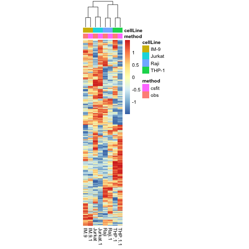

# MWG_deconvolution
R code to perform deconvolution of transcriptomic and proteomic data
  
  
### Partial deconvolution using available signatures
- Cibersort on Abbas dataset  
  
R code: [[MD]](code/20190621_Abbas.cibersort.md), CIBERSORT count: [[RDA]](output/abbas.cibersort.RData)  
  
- Cibersort on EM131 dataset  
  
R code: [[MD]](code/20190621_HBV.cibersort.md), CIBERSORT count: [[RDA]](output/em131.cibersort.RData)  
  
  
### Partial deconvolution using available proportions
- csfit on Abbas dataset  
  
R code: [[MD]](code/20190623_Abbas.csfit.md)  
  
  
### Complete deconvolution from globas expression
- deconf on Abbas dataset  
  
R code: [[MD]](code/20190623_Abbas.deconf.md)  
