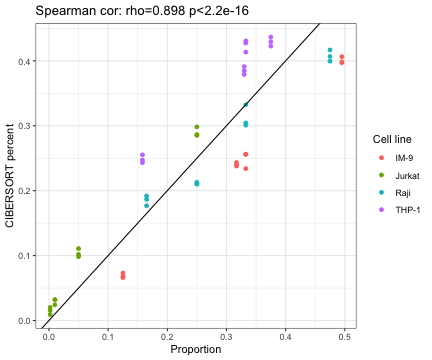

load required packages

```r
suppressPackageStartupMessages(library(package = "knitr"))
suppressPackageStartupMessages(library(package = "Biobase"))
suppressPackageStartupMessages(library(package = "Rserve"))
suppressPackageStartupMessages(library(package = "GEOquery"))
suppressPackageStartupMessages(library(package = "tidyverse"))
```

Define session options

```r
workDir <- dirname(getwd())
opts_chunk$set(tidy = FALSE, fig.path = "../figure/")
options(stringsAsFactors  = FALSE,
	readr.num_columns = 0)
```

Download Abbas ExpressionSet from GEO (Abbas AR. et al., 2009)

```r
# GSE11058
eset <- getGEO(GEO = "GSE11058")[[1]]
# split pure profiles from mixed profiles
esetMix <- eset[, eset$characteristics_ch1.1 %in% "mixed cells"]
esetPure <- eset[, eset$characteristics_ch1.1 %in% "purified cells"]
# transform probe 2 gene
probe2gene <- fData(esetMix)$"Gene Symbol" %>%
			strsplit(split = " /// ") %>%
			setNames(nm = fData(esetMix)$"ID") %>%
			stack() %>%
			filter(!duplicated(values))
exprsMat <- exprs(esetMix)[probe2gene$ind, ]
rownames(exprsMat) <- probe2gene$values
```

Fetch from GEO the description of the mixture of cells

```r
# fetch SOFT file
url <- file.path("ftp://ftp.ncbi.nlm.nih.gov/geo/series/GSE11nnn/GSE11058/soft",
		 "GSE11058_family.soft.gz")
soft <- read_delim(file = url, delim = "\n", col_names = FALSE) %>%
  filter(grepl(pattern = "Series_overall_design = Mix", X1)) %>%
  mutate(`Sample name` = gsub(pattern     = ".+(Mix[A-Z]).+",
			      replacement = "\\1", X1))
# calculate proportion of each cell line in the mixtures
mix2cellProp <- gsub(pattern = ".+ \\(|\\)", replacement = "", soft$X1) %>%
  strsplit(split = ", ") %>%
  setNames(nm = soft$"Sample name") %>%
  stack() %>%
  mutate(`Cell line` = gsub(pattern     = "(.+): .+",
	                    replacement = "\\1",
	                    values),
			values = gsub(pattern = ".+: ",
				      replacement=  "\\1",
				      values),
			values = as.numeric(values)) %>%
  group_by(ind) %>%
    mutate(perc = values/sum(values)) %>%
    ungroup() %>%
    rename(`Sample name` = ind)
```

Unzip CIBERSORT package (Newman AM. et al., 2015)

```r
unzip(zipfile = file.path(workDir, "utils/CIBERSORT_package.zip"),
      exdir   = file.path(workDir, "utils/CIBERSORT"))
```

Prepare CIBERSORT input files

```r
# create pure profile signature
matPure <- exprs(esetPure)[probe2gene$ind, ]
rownames(matPure) <- probe2gene$values
top500sigma2 <- apply(log2(matPure), MARGIN = 1, FUN = var) %>%
  data.frame(sigma2 = .) %>%
  mutate(rowname = rownames(matPure)) %>%
  top_n(n = 500, wt = sigma2)
lm3 <- by(t(matPure[top500sigma2$rowname, ]), INDICES = esetPure$characteristics_ch1,
	  FUN = colMeans) %>%
  do.call(what = cbind) %>%
  as.data.frame() %>%
  rownames_to_column() %>%
  rename(GeneSymbol = rowname)
subMat <- exprsMat[lm3$GeneSymbol, ] %>%                                   
  as.data.frame() %>%                                                           
  rownames_to_column() %>%                                                   
  rename(GeneSymbol = rowname)
# write gene counts and cell subsets signature in CIBERSORT directory           
write_tsv(lm3, path = file.path(workDir, "utils/CIBERSORT/abbas.lm3.txt"))    
write_tsv(subMat, path = file.path(workDir, "utils/CIBERSORT/abbas.exprs.txt"))  
```

Lauch CIBERSORT (java app)

```r
Rserve(args = "--no-save --quiet --slave")
```

```
## Starting Rserve:
##  /usr/local/Cellar/r/3.6.0_2/lib/R/bin/R CMD /usr/local/lib/R/3.6/site-library/Rserve/libs//Rserve --no-save --quiet --slave
```

```r
cmd <- paste("java -Xmx3g -Xms3g -jar",
	     file.path(workDir, "utils/CIBERSORT/CIBERSORT.jar"),               
             "-M",                                                              
             file.path(workDir, "utils/CIBERSORT/abbas.exprs.txt"),              
             "-B",                                                              
             file.path(workDir, "utils/CIBERSORT/abbas.lm3.txt"))
# read output
freqLS <- system(command = cmd, intern = TRUE)                                  
skip <- max(grep(pattern = "CIBERSORT", freqLS))                                
freqLS <- freqLS[-seq(to = skip)]                                               
head <- strsplit(freqLS[1], split = "\t") %>%                                   
  unlist()                                                                      
freqDF <- strsplit(freqLS[-1], split = "\t") %>%                                
  do.call(what = rbind) %>%                                                     
  as.data.frame() %>%                                                           
  setNames(nm = head) %>%                                                       
  mutate(Column = colnames(exprsMat))
# save ouput
save(freqDF, file = file.path(workDir, "output/abbas.cibersort.RData"))      
```

Plot proportion of cells and estimated by CIBERSORT

```r
# cibersort: Mono(Mono+MacroM[0-2])
#            T (CD4naive,CD4memrest,CD4memact,Tfh,Treg,CD8,gammadeltaT)
#            B (Bnaive, Bmem, Plasma)
# Observed: T (Jurkat), B (IM-9, Raji), Mono (THP-1)

ciberDF  <- freqDF %>%
  select(-`P-value`, -`Pearson Correlation`, -RMSE) %>%
  gather(`Cell line`, value, -Column) %>%
		    merge(y = select(pData(esetMix), geo_accession, characteristics_ch1),
			  by.x = "Column", by.y = "geo_accession") %>%
  rename(`Sample name` = characteristics_ch1) %>%
		       mutate(value = as.numeric(value))
# plot estimate cell frequencies and experimentally validated counts
plotDF <- merge(x = ciberDF, y = mix2cellProp, by = c("Sample name", "Cell line"))
# correlate estimate and observed frequencies
fit <- cor.test(formula = ~perc+value,
	 data = plotDF,
	 method = "spearman")
print(fit)
```

```
## 
## 	Spearman's rank correlation rho
## 
## data:  perc and value
## S = 1870.4, p-value < 2.2e-16
## alternative hypothesis: true rho is not equal to 0
## sample estimates:
##       rho 
## 0.8984825
```

```r
ggplot(data = plotDF,
       mapping = aes(x = perc, y = value)) +
  geom_point(mapping = aes(color = `Cell line`)) +
  geom_abline(slope = 1, intercept = 0) +
  labs(x = "Proportion",
       y = "CIBERSORT percent",
       title = paste0("Spearman cor: rho=",
		      signif(fit$estimate, digits = 3),
		      " p<2.2e-16")) +
  theme_bw()
```



Delete temporary files

```r
unlink(file.path(workDir, "utils/CIBERSORT"), recursive = TRUE)
```

Print session info

```r
sessionInfo()
```

```
## R version 3.6.0 (2019-04-26)
## Platform: x86_64-apple-darwin18.5.0 (64-bit)
## Running under: macOS Mojave 10.14.5
## 
## Matrix products: default
## BLAS/LAPACK: /usr/local/Cellar/openblas/0.3.6_1/lib/libopenblasp-r0.3.6.dylib
## 
## locale:
## [1] en_US.UTF-8/en_US.UTF-8/en_US.UTF-8/C/en_US.UTF-8/en_US.UTF-8
## 
## attached base packages:
## [1] parallel  stats     graphics  grDevices utils     datasets  methods  
## [8] base     
## 
## other attached packages:
##  [1] GEOquery_2.52.0     Rserve_1.8-6        Biobase_2.44.0     
##  [4] BiocGenerics_0.30.0 knitr_1.23          forcats_0.4.0      
##  [7] stringr_1.4.0       dplyr_0.8.1         purrr_0.3.2        
## [10] readr_1.3.1         tidyr_0.8.3         tibble_2.1.3       
## [13] ggplot2_3.2.0       tidyverse_1.2.1    
## 
## loaded via a namespace (and not attached):
##  [1] tidyselect_0.2.5 xfun_0.7         haven_2.1.0      lattice_0.20-38 
##  [5] colorspace_1.4-1 generics_0.0.2   vctrs_0.1.0      utf8_1.1.4      
##  [9] rlang_0.3.4      pillar_1.4.1     glue_1.3.1       withr_2.1.2     
## [13] modelr_0.1.4     readxl_1.3.1     munsell_0.5.0    gtable_0.3.0    
## [17] cellranger_1.1.0 rvest_0.3.4      evaluate_0.14    labeling_0.3    
## [21] curl_3.3         fansi_0.4.0      highr_0.8        broom_0.5.2     
## [25] Rcpp_1.0.1       scales_1.0.0     backports_1.1.4  limma_3.40.2    
## [29] jsonlite_1.6     hms_0.4.2        digest_0.6.19    stringi_1.4.3   
## [33] grid_3.6.0       cli_1.1.0        tools_3.6.0      magrittr_1.5    
## [37] lazyeval_0.2.2   crayon_1.3.4     pkgconfig_2.0.2  zeallot_0.1.0   
## [41] xml2_1.2.0       lubridate_1.7.4  assertthat_0.2.1 httr_1.4.0      
## [45] rstudioapi_0.10  R6_2.4.0         nlme_3.1-140     compiler_3.6.0
```
