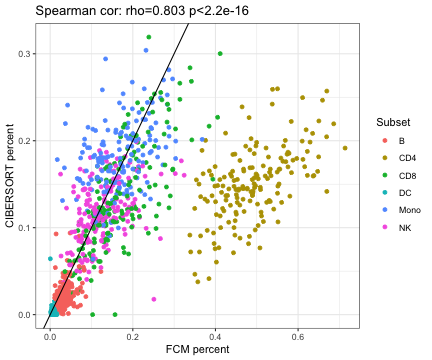

load required packages

```r
suppressPackageStartupMessages(library(package = "knitr"))
suppressPackageStartupMessages(library(package = "Biobase"))
suppressPackageStartupMessages(library(package = "Rserve"))
suppressPackageStartupMessages(library(package = "GEOquery"))
suppressPackageStartupMessages(library(package = "tidyverse"))
```

Define session options

```r
workDir <- dirname(getwd())
opts_chunk$set(tidy = FALSE, fig.path = "../figure/")
options(stringsAsFactors  = FALSE,
	readr.num_columns = 0)
```

Download EM131 ExpressionSet from GEO (Fourati S. et al., 2016)

```r
# GE65834
eset <- getGEO(GEO = "GSE65834")[[1]]
# transform probe 2 gene
probe2gene <- fData(eset)$"GeneSymbol" %>%
			strsplit(split = " ") %>%
			setNames(nm = fData(eset)$"ID") %>%
			stack() %>%
			filter(values != "")
exprsMat <- exprs(eset)[probe2gene$ind, ]
rownames(exprsMat) <- probe2gene$values
exprsMat <- 2^(exprsMat)
```

Unzip CIBERSORT package (Newman AM. et al., 2015)

```r
unzip(zipfile = file.path(workDir, "utils/CIBERSORT_package.zip"),
      exdir   = file.path(workDir, "utils/CIBERSORT"))
```

Prepare CIBERSORT input files

```r
# filter LM22 (leukocyte signature matrix of 22 subsets) to genes present on the
# affy array  
lm22 <- read_tsv(file = file.path(workDir, "utils/CIBERSORT/LM22.txt"))
sub22 <- lm22[lm22$"Gene symbol" %in% rownames(exprsMat), ]                     
subMat <- exprsMat[sub22$"Gene symbol", ] %>%                                   
  as.data.frame() %>%                                                           
  rownames_to_column() %>%                                                      
  rename(GeneSymbol = rowname)
# write gene counts and cell subsets signature in CIBERSORT directory           
write_tsv(sub22, path = file.path(workDir, "utils/CIBERSORT/em131.lm22.txt"))    
write_tsv(subMat, path = file.path(workDir, "utils/CIBERSORT/em131.exprs.txt"))  
```

Lauch CIBERSORT (java app)

```r
Rserve(args = "--no-save --quiet --slave")
```

```
## Starting Rserve:
##  /usr/local/Cellar/r/3.6.0_2/lib/R/bin/R CMD /usr/local/lib/R/3.6/site-library/Rserve/libs//Rserve --no-save --quiet --slave
```

```r
cmd <- paste("java -Xmx3g -Xms3g -jar",
	     file.path(workDir, "utils/CIBERSORT/CIBERSORT.jar"),               
             "-M",                                                              
             file.path(workDir, "utils/CIBERSORT/em131.exprs.txt"),              
             "-B",                                                              
             file.path(workDir, "utils/CIBERSORT/em131.lm22.txt"))
# read output
freqLS <- system(command = cmd, intern = TRUE)                                  
skip <- max(grep(pattern = "CIBERSORT", freqLS))                                
freqLS <- freqLS[-seq(to = skip)]                                               
head <- strsplit(freqLS[1], split = "\t") %>%                                   
  unlist()                                                                      
freqDF <- strsplit(freqLS[-1], split = "\t") %>%                                
  do.call(what = rbind) %>%                                                     
  as.data.frame() %>%                                                           
  setNames(nm = head) %>%                                                       
  mutate(Column = colnames(exprsMat))                                           
# save ouput                                                                    
save(freqDF, file = file.path(workDir, "output/em131.cibersort.RData"))      
```

Read flow cytometry counts

```r
fcmFile <- file.path(workDir, "input/Fig5ab_20141114_HBV.Fig5ab.input.csv")
fcmDF <- read_csv(file = fcmFile)
```

Plot percentage of cells measured by FCM and estimated by CIBERSORT

```r
# cibersort: DC (DCact+DCrest), Mono(Mono+MacroM[0-2]), NK (NKrest+NKact)
#            CD4 (CD4naive,CD4memrest,CD4memact,Tfh,Treg), CD8, B (Bnaive, Bmem, Plasma)
# fcm: CD4, CD8, Mono, DC (pDC+MDC1+MDC2), NK, B (DR+B+DR-B) 
plotDF <- select(freqDF, -`P-value`, -`Pearson Correlation`, -`RMSE`)

ciberDF  <- freqDF %>%
  select(-`P-value`, -`Pearson Correlation`, -RMSE) %>%
  gather(Subset, value, -Column) %>%
  mutate(value = as.numeric(value)) %>%
  spread(Subset, value) %>%
  mutate(DC = `Dendritic cells resting` + `Dendritic cells activated`,
	 Mono = Monocytes +
	   `Macrophages M0` +
	   `Macrophages M1` +
	   `Macrophages M2`,
	 NK = `NK cells resting` + `NK cells activated`,
	 CD4 = `T cells CD4 naive` +
	   `T cells CD4 memory resting` +
	   `T cells CD4 memory activated` +
	   `T cells follicular helper` +
	   `T cells regulatory (Tregs)`,
	 B = `B cells naive` + `B cells memory` + `Plasma cells`) %>%
  rename(CD8 = `T cells CD8`) %>%
  merge(y = pData(eset), by.x = "Column", by.y = "geo_accession") %>%
  select(`donor:ch1`, DC, Mono, NK, CD4, CD8, B) %>%
  gather(Subset, ciber.value, -`donor:ch1`) %>%
    rename(donor = `donor:ch1`)
# experimentally measured cell frequencies
countDF <- fcmDF %>%
  select(donor, `visit number`, contains(match = "All counts")) %>%
  mutate(DC = `All counts.CT PDC` + `All counts.CT mDC1` + `All counts.CT mDC2`,
	 B = `All counts. CT DR+ B` + `All counts. CT DR- B`) %>%
  rename(CD4 = `All counts.CT CD4`,
	 CD8 = `All counts.CT CD8`,
	 Mono = `All counts.CT Mono`,
	 NK = `All counts.CT ALL NK`) %>%
  select(donor, DC, Mono, NK, CD4, CD8, B) %>%
  gather(Subset, fcm.value, -donor)
# transform abosulete counts to cell frequencies
etaDF <- countDF %>%
  group_by(donor) %>%
  summarize(eta = sum(fcm.value))
countDF <- merge(x = countDF, y = etaDF, by = "donor", all.x = TRUE) %>%
  mutate(fcm.value = fcm.value/eta)

# plot estimate cell frequencies and experimentally validated counts
plotDF <- merge(x = ciberDF, y = countDF, by.x = c("donor", "Subset"))
# correlate estimate and observed frequencies
fit <- cor.test(formula = ~fcm.value+ciber.value,
	 data = plotDF,
	 method = "spearman")
print(fit)
```

```
## 
## 	Spearman's rank correlation rho
## 
## data:  fcm.value and ciber.value
## S = 34189888, p-value < 2.2e-16
## alternative hypothesis: true rho is not equal to 0
## sample estimates:
##       rho 
## 0.8032406
```

```r
ggplot(data = plotDF,
       mapping = aes(x = fcm.value, y = ciber.value)) +
  geom_point(mapping = aes(color = Subset)) +
  geom_abline(slope = 1, intercept = 0) +
  labs(x = "FCM percent",
       y = "CIBERSORT percent",
       title = paste0("Spearman cor: rho=",
		      signif(fit$estimate, digits = 3),
		      " p<2.2e-16")) +
  theme_bw()
```



Delete temporary files

```r
unlink(file.path(workDir, "utils/CIBERSORT"), recursive = TRUE)
```

Print session info

```r
sessionInfo()
```

```
## R version 3.6.0 (2019-04-26)
## Platform: x86_64-apple-darwin18.5.0 (64-bit)
## Running under: macOS Mojave 10.14.5
## 
## Matrix products: default
## BLAS/LAPACK: /usr/local/Cellar/openblas/0.3.6_1/lib/libopenblasp-r0.3.6.dylib
## 
## locale:
## [1] en_US.UTF-8/en_US.UTF-8/en_US.UTF-8/C/en_US.UTF-8/en_US.UTF-8
## 
## attached base packages:
## [1] parallel  stats     graphics  grDevices utils     datasets  methods  
## [8] base     
## 
## other attached packages:
##  [1] forcats_0.4.0       stringr_1.4.0       dplyr_0.8.1        
##  [4] purrr_0.3.2         readr_1.3.1         tidyr_0.8.3        
##  [7] tibble_2.1.3        ggplot2_3.2.0       tidyverse_1.2.1    
## [10] GEOquery_2.52.0     Rserve_1.8-6        Biobase_2.44.0     
## [13] BiocGenerics_0.30.0 knitr_1.23         
## 
## loaded via a namespace (and not attached):
##  [1] Rcpp_1.0.1       highr_0.8        cellranger_1.1.0 pillar_1.4.1    
##  [5] compiler_3.6.0   tools_3.6.0      digest_0.6.19    lubridate_1.7.4 
##  [9] jsonlite_1.6     evaluate_0.14    nlme_3.1-140     gtable_0.3.0    
## [13] lattice_0.20-38  pkgconfig_2.0.2  rlang_0.3.4      cli_1.1.0       
## [17] rstudioapi_0.10  curl_3.3         haven_2.1.0      xfun_0.7        
## [21] withr_2.1.2      httr_1.4.0       xml2_1.2.0       generics_0.0.2  
## [25] hms_0.4.2        grid_3.6.0       tidyselect_0.2.5 glue_1.3.1      
## [29] R6_2.4.0         readxl_1.3.1     limma_3.40.2     modelr_0.1.4    
## [33] magrittr_1.5     backports_1.1.4  scales_1.0.0     rvest_0.3.4     
## [37] assertthat_0.2.1 colorspace_1.4-1 labeling_0.3     stringi_1.4.3   
## [41] lazyeval_0.2.2   munsell_0.5.0    broom_0.5.2      crayon_1.3.4
```
