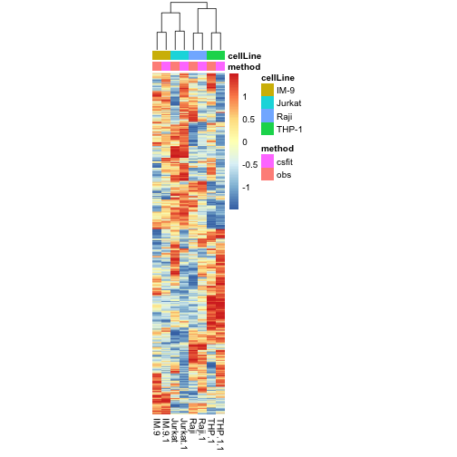

load required packages

```r
suppressPackageStartupMessages(library(package = "knitr"))
suppressPackageStartupMessages(library(package = "Biobase"))
suppressPackageStartupMessages(library(package = "csSAM"))
suppressPackageStartupMessages(library(package = "GEOquery"))
suppressPackageStartupMessages(library(package = "pheatmap"))
suppressPackageStartupMessages(library(package = "tidyverse"))
```

Define session options

```r
workDir <- dirname(getwd())
opts_chunk$set(tidy = FALSE, fig.path = "../figure/")
options(stringsAsFactors  = FALSE,
	readr.num_columns = 0)
```

Download Abbas ExpressionSet from GEO (Abbas AR. et al., 2009)

```r
# GSE11058
eset <- getGEO(GEO = "GSE11058")[[1]]
# split pure profiles from mixed profiles
esetMix <- eset[, eset$characteristics_ch1.1 %in% "mixed cells"]
esetPure <- eset[, eset$characteristics_ch1.1 %in% "purified cells"]
exprsMat <- exprs(esetMix)
```

Fetch from GEO the description of the mixture of cells

```r
# fetch SOFT file
url <- file.path("ftp://ftp.ncbi.nlm.nih.gov/geo/series/GSE11nnn/GSE11058/soft",
		 "GSE11058_family.soft.gz")
soft <- read_delim(file = url, delim = "\n", col_names = FALSE) %>%
  filter(grepl(pattern = "Series_overall_design = Mix", X1)) %>%
  mutate(`Sample name` = gsub(pattern     = ".+(Mix[A-Z]).+",
			      replacement = "\\1", X1))
# calculate proportion of each cell line in the mixtures
mix2cellProp <- gsub(pattern = ".+ \\(|\\)", replacement = "", soft$X1) %>%
  strsplit(split = ", ") %>%
  setNames(nm = soft$"Sample name") %>%
  stack() %>%
  mutate(`Cell line` = gsub(pattern     = "(.+): .+",
	                    replacement = "\\1",
	                    values),
			values = gsub(pattern = ".+: ",
				      replacement=  "\\1",
				      values),
			values = as.numeric(values)) %>%
  group_by(ind) %>%
    mutate(perc = values/sum(values)) %>%
    ungroup() %>%
    rename(`Sample name` = ind)
```

Perform csfit

```r
cc <- mix2cellProp %>%
  merge(y = select(pData(esetMix), characteristics_ch1, geo_accession),
	by.x = "Sample name", by.y = "characteristics_ch1") %>%
  select(-values, -`Sample name`) %>%
  spread(`Cell line`, perc) %>%
  column_to_rownames(var = "geo_accession")
fit <- csfit(G = t(log2(exprsMat)), cc = cc)
```

Draw heatmap based on randomly selected 500 probesets

```r
matPure <- by(t(log2(exprs(esetPure))),
	      INDICES = esetPure$characteristics_ch1,
	      FUN = colMeans) %>%
  do.call(what = cbind)

matComb <- cbind(t(scale(t(matPure))), t(scale(fit$ghat)))
annotCol <- data.frame(method = c(rep("obs", times = 4),
                                  rep("csfit", times = 4)),
                       cellLine= colnames(matComb))
colnames(matComb) <- make.unique(make.names(colnames(matComb)))
rownames(annotCol) <- colnames(matComb)
set.seed(seed = 1)
pheatmap(mat                      = matComb[sample(1:nrow(matComb), 5000), ],
         clustering_distance_cols = "correlation",
         clustering_method        = "ward.D",
         show_rownames            = FALSE,
         treeheight_row           = 0,
         cellwidth                = 10,
         annotation_col           = annotCol)
```



Print session info

```r
sessionInfo()
```

```
## R version 3.6.0 (2019-04-26)
## Platform: x86_64-apple-darwin18.5.0 (64-bit)
## Running under: macOS Mojave 10.14.5
## 
## Matrix products: default
## BLAS/LAPACK: /usr/local/Cellar/openblas/0.3.6_1/lib/libopenblasp-r0.3.6.dylib
## 
## locale:
## [1] en_US.UTF-8/en_US.UTF-8/en_US.UTF-8/C/en_US.UTF-8/en_US.UTF-8
## 
## attached base packages:
## [1] compiler  parallel  stats     graphics  grDevices utils     datasets 
## [8] methods   base     
## 
## other attached packages:
##  [1] forcats_0.4.0       stringr_1.4.0       dplyr_0.8.1        
##  [4] purrr_0.3.2         readr_1.3.1         tidyr_0.8.3        
##  [7] tibble_2.1.3        ggplot2_3.2.0       tidyverse_1.2.1    
## [10] pheatmap_1.0.12     GEOquery_2.52.0     csSAM_1.2.4        
## [13] Biobase_2.44.0      BiocGenerics_0.30.0 knitr_1.23         
## 
## loaded via a namespace (and not attached):
##  [1] tidyselect_0.2.5   xfun_0.7           haven_2.1.0       
##  [4] lattice_0.20-38    colorspace_1.4-1   generics_0.0.2    
##  [7] vctrs_0.1.0        utf8_1.1.4         rlang_0.3.4       
## [10] pillar_1.4.1       glue_1.3.1         withr_2.1.2       
## [13] RColorBrewer_1.1-2 modelr_0.1.4       readxl_1.3.1      
## [16] munsell_0.5.0      gtable_0.3.0       cellranger_1.1.0  
## [19] rvest_0.3.4        evaluate_0.14      curl_3.3          
## [22] fansi_0.4.0        highr_0.8          broom_0.5.2       
## [25] Rcpp_1.0.1         backports_1.1.4    scales_1.0.0      
## [28] limma_3.40.2       jsonlite_1.6       hms_0.4.2         
## [31] stringi_1.4.3      grid_3.6.0         cli_1.1.0         
## [34] tools_3.6.0        magrittr_1.5       lazyeval_0.2.2    
## [37] crayon_1.3.4       pkgconfig_2.0.2    zeallot_0.1.0     
## [40] xml2_1.2.0         lubridate_1.7.4    assertthat_0.2.1  
## [43] httr_1.4.0         rstudioapi_0.10    R6_2.4.0          
## [46] nlme_3.1-140
```
