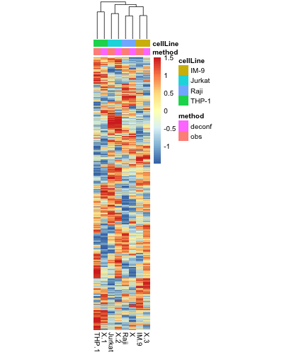

load required packages

```r
suppressPackageStartupMessages(library(package = "knitr"))
suppressPackageStartupMessages(library(package = "Biobase"))
suppressPackageStartupMessages(library(package = "GEOquery"))
suppressPackageStartupMessages(library(package = "pheatmap"))
suppressPackageStartupMessages(library(package = "deconf"))
suppressPackageStartupMessages(library(package = "tidyverse"))
```

Define session options

```r
workDir <- dirname(getwd())
opts_chunk$set(tidy = FALSE, fig.path = "../figure/")
options(stringsAsFactors  = FALSE,
	readr.num_columns = 0)
```

Download Abbas ExpressionSet from GEO (Abbas AR. et al., 2009)

```r
# GSE11058
eset <- getGEO(GEO = "GSE11058")[[1]]
# split pure profiles from mixed profiles
esetMix <- eset[, eset$characteristics_ch1.1 %in% "mixed cells"]
esetPure <- eset[, eset$characteristics_ch1.1 %in% "purified cells"]
exprsMat <- exprs(esetMix)
```

Fetch from GEO the description of the mixture of cells

```r
# fetch SOFT file
url <- file.path("ftp://ftp.ncbi.nlm.nih.gov/geo/series/GSE11nnn/GSE11058/soft",
		 "GSE11058_family.soft.gz")
soft <- read_delim(file = url, delim = "\n", col_names = FALSE) %>%
  filter(grepl(pattern = "Series_overall_design = Mix", X1)) %>%
  mutate(`Sample name` = gsub(pattern     = ".+(Mix[A-Z]).+",
			      replacement = "\\1", X1))
# calculate proportion of each cell line in the mixtures
mix2cellProp <- gsub(pattern = ".+ \\(|\\)", replacement = "", soft$X1) %>%
  strsplit(split = ", ") %>%
  setNames(nm = soft$"Sample name") %>%
  stack() %>%
  mutate(`Cell line` = gsub(pattern     = "(.+): .+",
	                    replacement = "\\1",
	                    values),
			values = gsub(pattern = ".+: ",
				      replacement=  "\\1",
				      values),
			values = as.numeric(values)) %>%
  group_by(ind) %>%
    mutate(perc = values/sum(values)) %>%
    ungroup() %>%
    rename(`Sample name` = ind)
cc <- mix2cellProp %>%
  merge(y = select(pData(esetMix), characteristics_ch1, geo_accession),
	by.x = "Sample name", by.y = "characteristics_ch1") %>%
  select(-values, -`Sample name`) %>%
  spread(`Cell line`, perc) %>%
  column_to_rownames(var = "geo_accession")
```

Perform deconf

```r
# ilter on Nakaya
gmtFile <- "NakayaHI_2011_NatImmunol.SupplementaryTable4.PBMC_subsets.gmt"
gmtFile <- file.path(workDir, "input", gmtFile)
cNames <- count_fields(file = gmtFile, tokenizer = tokenizer_tsv()) %>%
  max() %>%
  seq(from = 1) %>%
  paste0("X", .)
nakayaLS <- read_tsv(file = gmtFile, col_names = cNames) %>%
  gather(cname, value, -X1, -X2) %>%
  mutate(X1 = toupper(X1)) %>%
  filter(!is.na(value)) %>%
  select(value, X1) %>%
  unstack()
pbs2symbol  <- strsplit(fData(esetMix)$"Gene Symbol", split = " /// ") %>%
  setNames(nm = fData(esetMix)$ID) %>%
  stack()
esetFilter <- esetMix[pbs2symbol$ind[pbs2symbol$values %in%
				       unlist(nakayaLS)], ]
set.seed(seed = 17)
capture.output(fit <- deconfounding(I            = exprs(esetFilter),
				    n.cell.types = 4,
				    n.iterations = 100),
	       file = "/dev/null")
# compared infered freq to obs
r <- cor(t(fit$C$Matrix), cc)
print(r)
```

```
##             IM-9     Jurkat       Raji       THP-1
## [1,]  0.01144977 -0.2509482  0.9067424 -0.95851008
## [2,]  0.11234819  0.1418419 -0.8426893  0.80791560
## [3,] -0.88772915  0.9622496 -0.1474301  0.43376552
## [4,]  0.82571742 -0.8553730 -0.1380354 -0.07382517
```

```r
predCellType <- apply(r, MARGIN = 1, FUN = which.max) %>%
  colnames(cc)[.]
freqHat <- fit$C$Matrix %>%
  as.data.frame() %>%
  setNames(nm = sampleNames(esetFilter)) %>%
  rowid_to_column() %>%
  gather(cname, value, -rowid) %>%
  mutate(predCellType = predCellType[rowid])

plotDF <- cc %>%
  rownames_to_column() %>%
  gather(cname, obs, -rowname) %>%
  merge(y = freqHat, by.x = c("rowname", "cname"),
        by.y = c("cname", "predCellType"))

ggplot(data = plotDF,
       mapping = aes(x = obs, y = value)) +
  geom_point(mapping = aes(color = cname)) +
  geom_abline(slope = 1, intercept = 0) +
  scale_x_continuous(limits = c(0, 1)) +
  scale_y_continuous(limits = c(0, 1)) +
  labs(x = "Real proportions", y = "Inferred proportions") +
  scale_color_discrete(name = "Cell line") +
  theme_bw()
```


```r
print(cor.test(formula = ~obs+value,
               data = plotDF))
```

```
## 
## 	Pearson's product-moment correlation
## 
## data:  obs and value
## t = 9.8466, df = 46, p-value = 6.64e-13
## alternative hypothesis: true correlation is not equal to 0
## 95 percent confidence interval:
##  0.7041832 0.8976329
## sample estimates:
##       cor 
## 0.8235414
```

Draw heatmap based on randomly selected 500 probesets

```r
matPure <- by(t(log2(exprs(esetPure))),
	      INDICES = esetPure$characteristics_ch1,
	      FUN     = colMeans) %>%
  do.call(what = cbind)
matPureFilter <- matPure[featureNames(esetFilter), ]
matComb <- cbind(t(scale(t(matPureFilter))),
		 t(scale(t(fit$S$Matrix))))
annotCol <- data.frame(method = c(rep("obs", times = 4),
                                  rep("deconf", times = 4)),
                       cellLine= c(colnames(matComb)[1:4],
				   predCellType))
colnames(matComb) <- make.unique(make.names(colnames(matComb)))
rownames(annotCol) <- colnames(matComb)
pheatmap(mat                      = matComb,
         show_rownames            = FALSE,
         treeheight_row           = 0,
         cellwidth                = 10,
         annotation_col           = annotCol)
```



Print session info

```r
sessionInfo()
```

```
## R version 3.6.0 (2019-04-26)
## Platform: x86_64-apple-darwin18.5.0 (64-bit)
## Running under: macOS Mojave 10.14.5
## 
## Matrix products: default
## BLAS/LAPACK: /usr/local/Cellar/openblas/0.3.6_1/lib/libopenblasp-r0.3.6.dylib
## 
## locale:
## [1] en_US.UTF-8/en_US.UTF-8/en_US.UTF-8/C/en_US.UTF-8/en_US.UTF-8
## 
## attached base packages:
## [1] parallel  stats     graphics  grDevices utils     datasets  methods  
## [8] base     
## 
## other attached packages:
##  [1] corpcor_1.6.9       forcats_0.4.0       stringr_1.4.0      
##  [4] dplyr_0.8.1         purrr_0.3.2         readr_1.3.1        
##  [7] tidyr_0.8.3         tibble_2.1.3        ggplot2_3.2.0      
## [10] tidyverse_1.2.1     pheatmap_1.0.12     knitr_1.23         
## [13] GEOquery_2.52.0     Biobase_2.44.0      BiocGenerics_0.30.0
## [16] deconf_1.0         
## 
## loaded via a namespace (and not attached):
##  [1] tidyselect_0.2.5   xfun_0.7           haven_2.1.0       
##  [4] lattice_0.20-38    colorspace_1.4-1   generics_0.0.2    
##  [7] rlang_0.3.4        pillar_1.4.1       glue_1.3.1        
## [10] withr_2.1.2        RColorBrewer_1.1-2 modelr_0.1.4      
## [13] readxl_1.3.1       munsell_0.5.0      gtable_0.3.0      
## [16] cellranger_1.1.0   rvest_0.3.4        evaluate_0.14     
## [19] labeling_0.3       curl_3.3           highr_0.8         
## [22] broom_0.5.2        Rcpp_1.0.1         scales_1.0.0      
## [25] backports_1.1.4    limma_3.40.2       jsonlite_1.6      
## [28] digest_0.6.19      hms_0.4.2          stringi_1.4.3     
## [31] grid_3.6.0         cli_1.1.0          tools_3.6.0       
## [34] magrittr_1.5       lazyeval_0.2.2     crayon_1.3.4      
## [37] pkgconfig_2.0.2    xml2_1.2.0         lubridate_1.7.4   
## [40] assertthat_0.2.1   httr_1.4.0         rstudioapi_0.10   
## [43] R6_2.4.0           nlme_3.1-140       compiler_3.6.0
```
